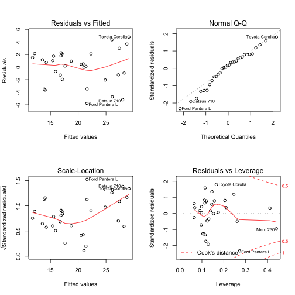

Automatic vs Manual Transmission: Which will take you further?
========================================================
## Summary
We look at the relationship between the number of miles per gallon a car can travel and how this relates to the type of transmission (automatic or manual). Extracting the four covariates with the lowest correlation we build a simple linear regression model to capture a resonably unbiased relationship between transmission type and miles per gallon. According to the model (adjusted R^2 0.77 and all coefficients significance < 0.05 in a t-test), cars with manual transmission generally travels 5.1 miles further per gallon of gasoline. It should be noted that allthough the fuel consumption for manual transmission seems more efficient, the standard deviation for the coefficient is quite large (95% confidence interval ranges from 1.1 to 9.0 increase in mpg), making it difficult to quantify the strength of this relationship.

## Introduction
The aim of this article is to examine the relationship between the number of miles per gallon a car can travel and how this is related to its type of transmission: manual or automatic. Below is a plot illustrating this relation if isolated, displaying a clear difference in mpg across the two types of transmission. However, this model is quite a simplification and we might find confounding variables if we try to build a model that includes a more complete set of the cars and their different properties.

 

Transmission type and its effect on miles per gallon, 1 is for manual transmission.

## Choosing a model
The goal of this artile is to build a model that both possesses good explanatory power as well as resonable estimates on the actual impact of the relevant car properties. For the first part, we will focus on adjusted R^2, which measures the models ability to explain the variance in outcome. For the latter part, we will look at the p-value and confidence intervall of the regressor of choice, ie transmission type effect on mpg, in order to quantify the actual impact.

Since our dataset is quite small (32 observations) the key is to strike a balance between capturing as much of the variance in as few variables as possible. This is to maintain an acceptable number of degrees of freedom, which will be required to maintain certainty in the actual coefficients of the covariates. 

I've choosen 4 models to compare:

1. mpg as an outcome only of transmission type (mostly out of curiosity)
2. mpg as an outcome of the 4 covariates with least internal correlation (less correlation should capture more of the variance per coviariate)
3. mpg as an outcome of the 6 covariates with least internal correlation
4. mpg as an outcome of all the covariates

Finding the covariates with least internal correlation was done simply by creating a Pearson correlation matrix, and summing the total correlation by each of the covariates. 


```r
M <- cor(mtcars[, -1])
sort(rowSums(abs(M)))
```

```
##  carb  qsec  gear    am  drat    vs    hp    wt  disp   cyl 
## 4.748 4.842 4.944 5.012 5.606 5.928 6.281 6.475 6.977 7.161
```


Looking at an analysis of the variance we can see that each added covariate is improving the model as the sum of the squared residuals (RSS), ie the part of the variance that isn't explained by our model, is reduced.


```
## Analysis of Variance Table
## 
## Model 1: mpg ~ am
## Model 2: mpg ~ carb + qsec + gear + am
## Model 3: mpg ~ carb + qsec + gear + am + drat + vs
## Model 4: mpg ~ cyl + disp + hp + drat + wt + qsec + vs + am + gear + carb
##   Res.Df RSS Df Sum of Sq     F  Pr(>F)    
## 1     30 721                               
## 2     27 228  3       493 23.38 6.8e-07 ***
## 3     25 206  2        23  1.61    0.22    
## 4     21 147  4        58  2.07    0.12    
## ---
## Signif. codes:  0 '***' 0.001 '**' 0.01 '*' 0.05 '.' 0.1 ' ' 1
```


Looking at the explanatory power of these models (adjusted R^2), we can see that a more complete covariate set (models 3 and 4) creates strong model. However, these models also comes with uncertainty of the actual value of the coefficients, something we can observe by looking at the p-values of the different models.


```
##     model AdjRSquared
## 1 model 1      0.3385
## 2 model 2      0.7672
## 3 model 3      0.7735
## 4 model 4      0.8066
```

```
## [1] "model 1"
```

```
##             Estimate Std. Error t value  Pr(>|t|)
## (Intercept)   17.147      1.125  15.247 1.134e-15
## am             7.245      1.764   4.106 2.850e-04
```

```
## [1] "model 2"
```

```
##             Estimate Std. Error t value  Pr(>|t|)
## (Intercept)  -2.7033     8.2679  -0.327 0.7462214
## carb         -1.8523     0.4859  -3.812 0.0007259
## qsec          0.8816     0.4180   2.109 0.0443314
## gear          2.7690     1.3115   2.111 0.0441380
## am            5.0645     1.9299   2.624 0.0141142
```

```
## [1] "model 3"
```

```
##             Estimate Std. Error  t value Pr(>|t|)
## (Intercept)   0.5965    11.5196  0.05178 0.959113
## carb         -1.6831     0.4999 -3.36676 0.002462
## qsec          0.4517     0.5586  0.80856 0.426399
## gear          1.7015     1.4540  1.17026 0.252933
## am            4.0671     2.0394  1.99424 0.057140
## drat          2.1085     1.6265  1.29637 0.206687
## vs            1.5001     1.9905  0.75363 0.458113
```

```
## [1] "model 4"
```

```
##             Estimate Std. Error t value Pr(>|t|)
## (Intercept) 12.30337   18.71788  0.6573  0.51812
## cyl         -0.11144    1.04502 -0.1066  0.91609
## disp         0.01334    0.01786  0.7468  0.46349
## hp          -0.02148    0.02177 -0.9868  0.33496
## drat         0.78711    1.63537  0.4813  0.63528
## wt          -3.71530    1.89441 -1.9612  0.06325
## qsec         0.82104    0.73084  1.1234  0.27394
## vs           0.31776    2.10451  0.1510  0.88142
## am           2.52023    2.05665  1.2254  0.23399
## gear         0.65541    1.49326  0.4389  0.66521
## carb        -0.19942    0.82875 -0.2406  0.81218
```


## Conclusion

All in all, to maintain both a reasonably unbiased estimate of the variance and precision of the coefficients we should choose model 2. This model states that a car with manual transmission generally travel 5.1 miles further per gallon than a car with automatic transmission. One should note that the standard deviation of coeffiecient is quite large, leaving the exact relationship between the two somewhat uncertain.

Confidence interval for increase in fuel efficiency for manual transmission:

```
## [1] 1.105 9.024
```


## Appendix: Residual Analysis

A brief analysis of of the residuals shows no signs of hetroskedacity or missing variables (residuals vs fitted values). Judging by the QQ plot the residuals seem to follow normality.
 


